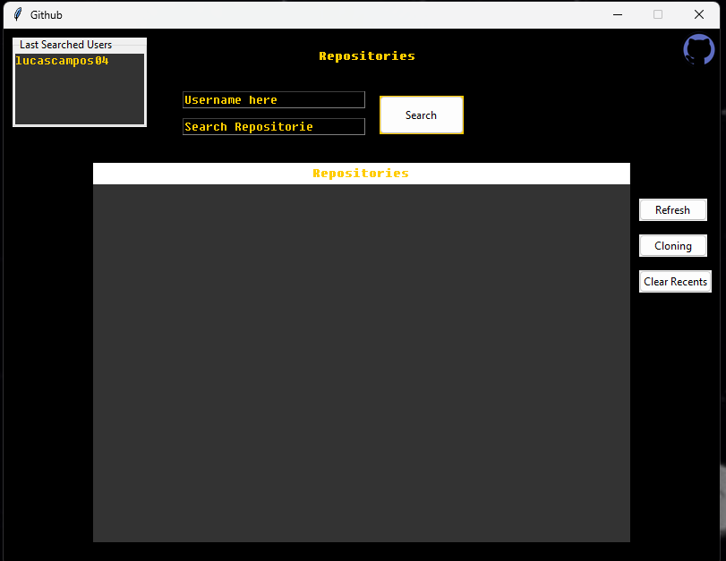

<div align="center" id="top"> 

  &#xa0;

  <!-- <a href="https://github_repository_viewer.netlify.app">Demo</a> -->
</div>

<h1 align="center">Visualizador de Repositórios do GitHub</h1>
<!-- <h4 align="center"> 
	🚧  Visualizador_de_Repositórios_do_GitHub 🚀 Em construção...  🚧
</h4> 

<hr> -->


<br>

## :dart: Sobre ##
O Visualizador de Repositórios do GitHub é uma aplicação em Python que permite aos usuários buscar e interagir com repositórios hospedados no GitHub de forma fácil e intuitiva. Com esta aplicação, os usuários podem pesquisar repositórios por nome de usuário, visualizar uma lista dos usuários recentes, clonar repositórios para sua máquina local e abrir os repositórios em seus navegadores padrão.

## :rocket: Tecnologias ##

As seguintes ferramentas foram utilizadas neste projeto:

- [Python](https://expo.org/)

## :white_check_mark: Requisitos ##

Antes de começar :checkered_flag:, você precisa ter o [Git](https://git-scm.com) e o [Python](https://python.org/) instalados.

## :checkered_flag: Começando ##

```bash
# Clone este projeto
$ git clone https://github.com/lucascampos04/github_repository_viewer

# Acesse
$ cd github_repository_viewer

# Execute o projeto
$ python .\main.py

```
Licença
Este projeto está sob licença MIT. Para mais detalhes, consulte o arquivo LICENSE.

Feito por <a href="https://github.com/lucascampos04" target="_blank">Lucas Oliveira Campos</a>